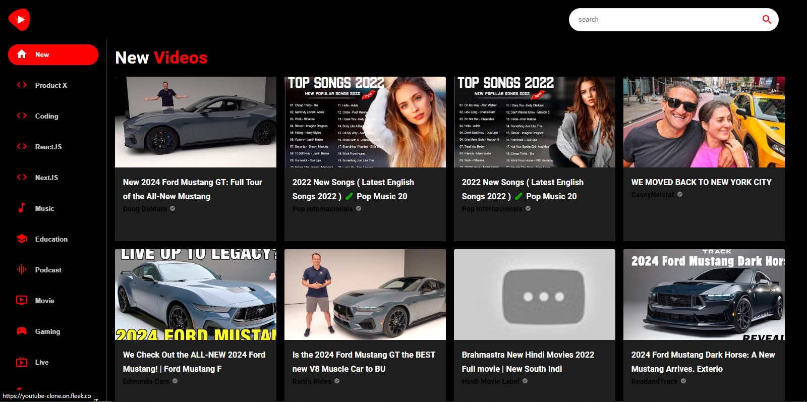
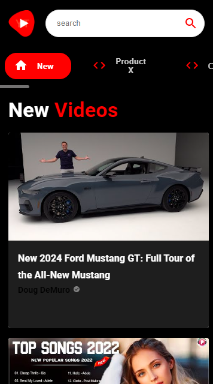
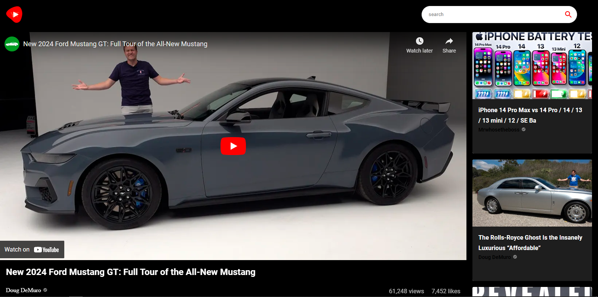
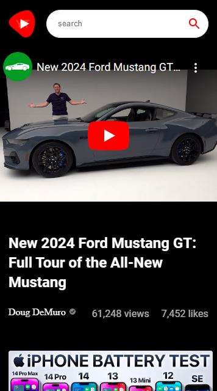
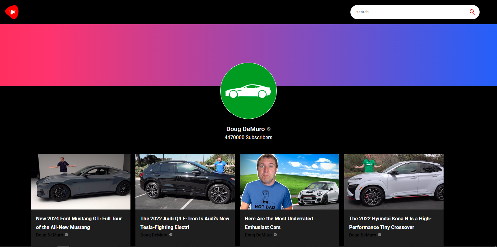
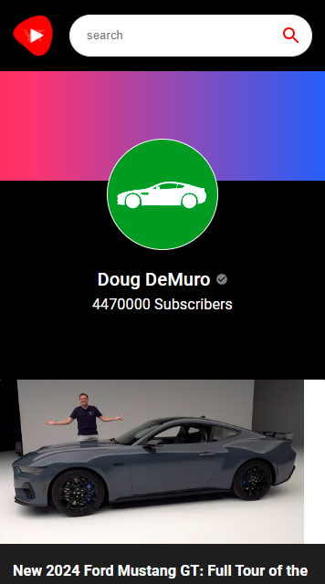
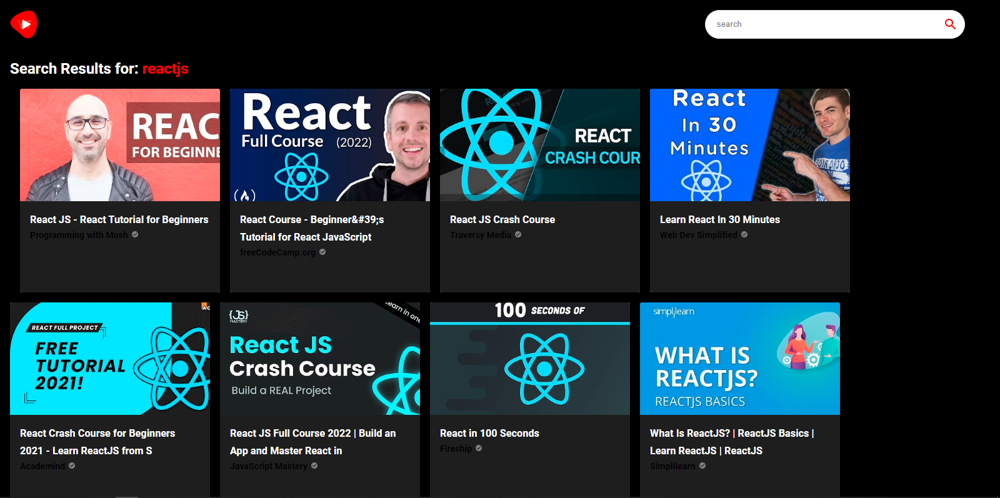
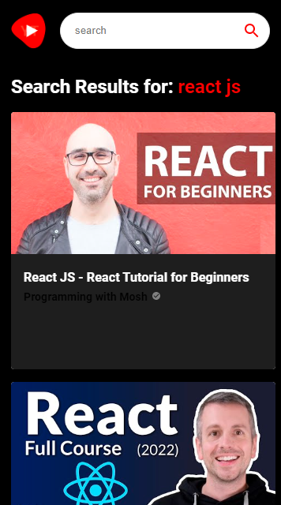

# YOUTUBE CLONE

**It is responsive video streaming web app developed using Reactjs and Rapid API**.

This is the frontend repository

## Core packages

1. React Hooks (useState, useEffect)
2. React Router - Routing
3. Material UI
5. Network calls - Axios
6. React Player

## Features

1. Home (Landing Page)
2. Video Player ( With Realted videos)
3. Channel (All videos of the channel)
4. Search (Get search results)

## Running locally

run <code>npm i</code> and <code>npm start</code> to see the ListenUp in action

## Running Online

Click on the link below  to see the Youtube Clone in action

https://youtube-clone.on.fleek.co/

## UI

 

 
<h3>HOME</h3>

 

 
<h3>VIDEO PLAYER</h3>

 

 
<h3>CHANNEL</h3>

 

 
<h3>SEARCH</h3>

